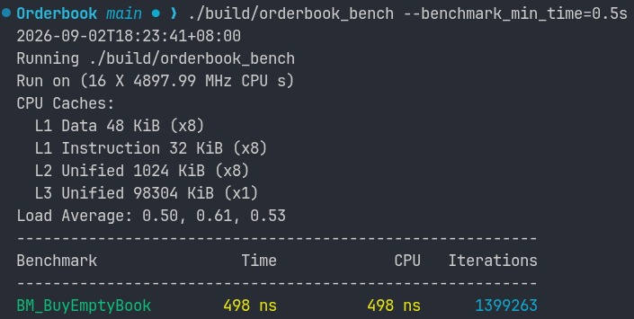
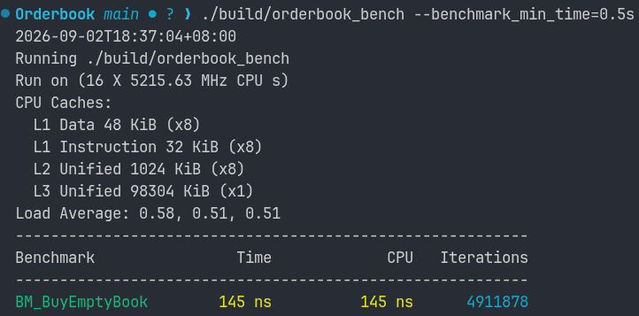

# BM_BuyEmptyBook

- Benchmark for buying a stock when there are no active orders

## how to best simulate empty book buy

### Approach 1:
```c
static void BM_BuyEmptyBook(benchmark::State &state) {
  for (auto _ : state) {
    state.PauseTiming();
    Orderbook ob("stock1");
    Trader t("t", 1000000);
    state.ResumeTiming();

    ob.buy(&t, 100, 10);
    benchmark::DoNotOptimize(ob);
    state.PauseTiming();
  }
}
```
- pausing state, creating Orderbook and trader, and then resuming state
- while also pausing state after buy is completed to negate destructor cost

Cons:

- still allocating new Orderbook every iteration, even if not timing allocation, it affects CPU's cache state (whether the book's memory is cold or fresh)
- in a real trading system, orderbook persists for millions of orders




### Approach 2:
```c
static void BM_BuyEmptyBook(benchmark::State &state) {
  Orderbook ob("stock1");
  Trader t("t", 1000000);
  int currTradeId = 0;

  for (auto _ : state) {
    ob.buy(&t, 100, 10);
    benchmark::DoNotOptimize(ob);

    // End of timed section
    state.PauseTiming();
    ob.cancelBuy(&t, currTradeId++, 100, 10);
    state.ResumeTiming();
  }
}
```
- having Orderbook and trader persist through benchmark
- at end of buy operation, pause state and cancelBuy and then resuming order
- thus book stays empty, trader never runs out of cash, and we can measure the true hot-cache insertion time.



Conclusion:
- By having orderbook and trader persist through the benchmark we are able to better capture the true cost of the buy operation.
- with a improvement from 498ns to 145ns which is a 3.43x increase speedup, and 70.9% faster


# BM_SellEmptyBook
- Benchmark for selling a stock when there are no active orders
```c
static void BM_SellEmptyBook(benchmark::State &state) {
  Orderbook ob("stock1");
  Trader t("t", 100000);
  int currTradeId = 0;
  t.changeInventoryAmount(&ob, 100);

  for (auto _ : state) {
    ob.sell(&t, 100, 10);
    benchmark::DoNotOptimize(ob);

    // End of timed section
    state.PauseTiming();
    ob.cancelSell(&t, currTradeId++, 100, 10)  ;
    state.ResumeTiming();
  }
}
```

# BM_BuyCrossSingleLevel
- benchmark for having a single buy order fill at one price level

```c
static void BM_BuyCrossSingleLevel(benchmark::State &state) {
  Orderbook ob("stock1");
  Trader b("b", 100);
  Trader s("s", 0);
  s.changeInventoryAmount(&ob, 10);
  ob.sell(&s, 10, 10);

  for (auto _ : state) {
    ob.buy(&b, 10, 10);
    
    state.PauseTiming();
    b.changeBalance(100);
    s.changeInventoryAmount(&ob, 10);
    ob.sell(&s, 10, 10);
    state.ResumeTiming();
  }
};
```

# BM_SellCrossSingleLevel
- benchmark for having a single sell order fill at one price level

```c
static void BM_SellCrossSingleLevel(benchmark::State &state) {
  Orderbook ob("stock1");
  Trader b("b", 100);
  Trader s("s", 0);
  s.changeInventoryAmount(&ob, 10);
  ob.buy(&b, 10, 10);

  for (auto _ : state) {
    ob.sell(&s, 10, 10);

    state.PauseTiming();
    b.changeBalance(100);
    s.changeInventoryAmount(&ob, 10);
    ob.buy(&b, 10, 10);
    state.ResumeTiming();
  }
};
```
