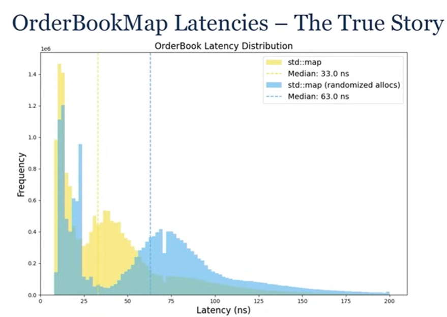
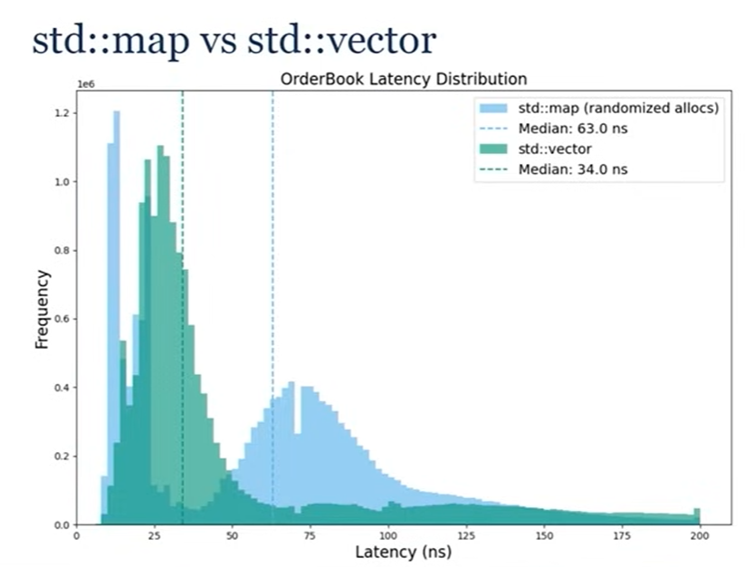
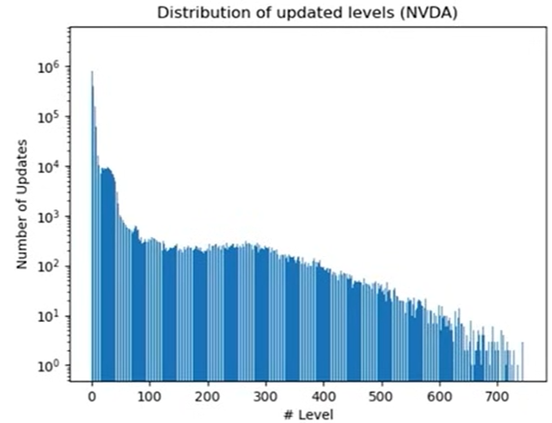
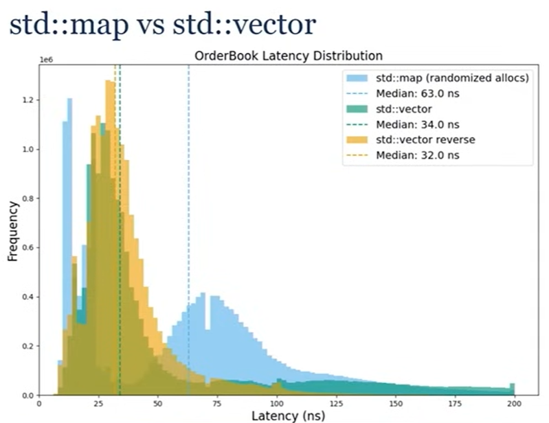
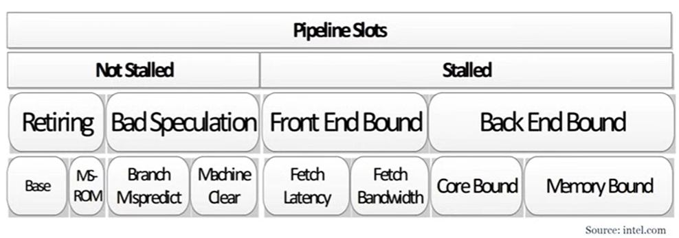
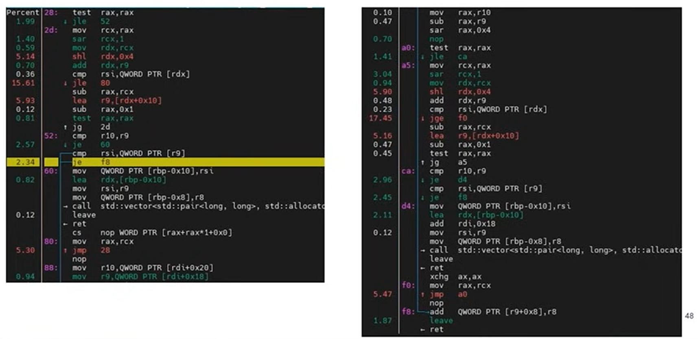
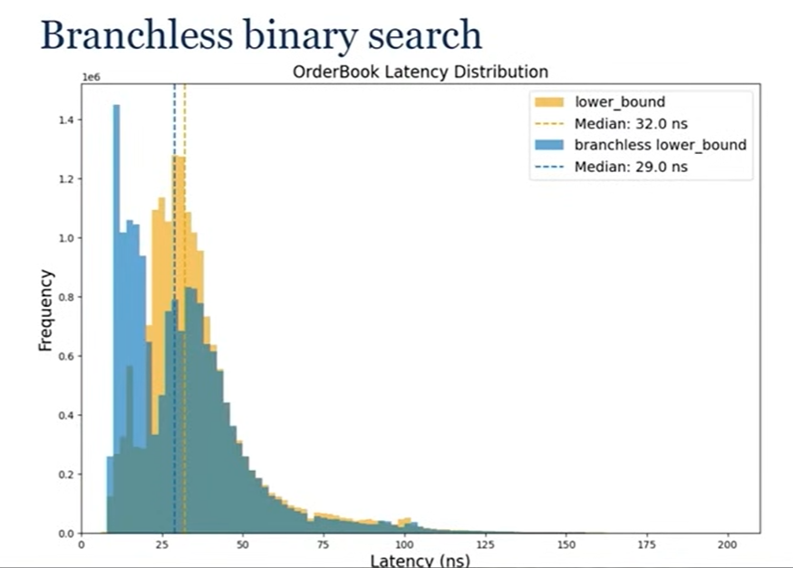
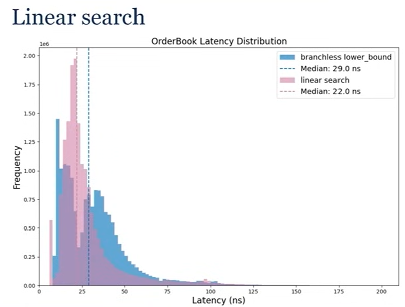

# Current implementation

OrdersAtPrice:
map<int, Order> order_queue

Orderbook:
map<int price, OrdersAtPrice> buy/sellOrderMap
unordered_map<int, Trade\*> traderRegistery
vector<Trade> tradeHistory

Trader:
unordered_map<Orderbook*, map<int price, vector<int tradeId>>> buy/sellOrders
unordered_map<Orderbook*, int amount> inventory

# Takeaways from "David Gross - CppCon 2024"

(https://www.youtube.com/watch?v=sX2nF1fW7kI&t=4499s)

Properties:
Two ordered sequences

- Bids: highest to lowest price
- Ask: lowest to highest price

Price Level

- Price
- Size: sum of all orders' size at this price level

Each Order has an ID (uint64_t) which is unique throughout the trading session (day)

API:

```c
enum class Side {Bid, Ask};
// in reality, those would be strong types
using OrderId = uint64_t;
using Volume = int64_t;
using Volume = int64_t;

void AddOrder(OrderId orderId, Side side, Price price, Volume volume);
void ModifyOrder(OrderId orderId, Volume newVolume);
void DeleteOrder(OrderId orderId);
```

No matter what data structure we choose for Orderbook, we need hash map

```c
void AddOrder(uint64_t orderId, Side side, Price price, Volume volume) {
  ...
  auto [it, inserted] = mOrders.emplace(orderId,...);
  EXPECT(inserted, "duplicate order");
  ...
}

void DeleteOrder(uint64_t orderId) {
  auto it = mOrder.find(orderId);
  EXPECT(it != mOrders.end(), "missing order");
}
```

## implementation 1 (std::map)

```c
std::map<Price, Volume, std::greater<Price>> mBidLevels;
std::map<Price, Volume, std::less<Price>> mAskLevels;

template <class T>
typename T::iterator AddOrder(T& levels, Price price, Volume volume){
  auto [it, inserted] = levels.try_emplace(price, volume);
  if (inserted==false)
    it -> second += volume;
  return it;
}

template <class T>
void DeleteOrder(typename T::iterator it, T& levels, Price price, Volume volume){
  it->second -= volume;
  if (it->second <= 0)
    levels.erase(it);
}
```

we can store iterator in hashmap

- since we are already doing hashmap lookup so might as well use that

AddOrder: log(N)
ModifyOrder: amortized constant
DeleteOrder: amortized constant

- std::map iterators are stable, meaning we can store it in our order data (in hash table)


important to look at latency distribution on the whole Orderbook

- if just looking a few percentile or median average or min/max you'd be missing some information
- gathered full week of market data on a dozen of stocks (run benchmark of performance on how it performs on real data)
- 2 peaks
  - one on very left for modify/delete, when you only do hashmap lookup
  - on right, when it goes through binary tree

Yellow distribution is bit of a lie

# Principles 1 : Most of the time you don't want node containers
- Blue distribution is the true distribution
  - between the orderbook operations, add some memory allocations
  - not to do much with them, but to randomize the heap
  - we are checking/measuring the cache locality of std::map, we know its poor since its a node container
  - in production very rare, there is zero dynamic memory allocation, always some around
  - by adding randomized allocations, we are replicating this pattern

## implementation 2 (std::vector)

using 2 vectors (bids and asks) and use std::lower_bound (binary search)

```c
std::vector<std::pair<Price, Volume>> mBidLevels;
std::vector<std::pair<Price, Volume>> mAskLevels;

void AddOrder(Side side, Price price, Volume volume) {
  if (side == Side::Bid)
    return AddOrder(bidLevels,price, volume, std::greater<Price>());
  else
    return AddOrder(bidLevels,price, volume, std::less<Price>());
}

template <class T, class Compare>
void AddOrder(T& levels, Price price, Volume volume, Compare comp) {
  auto it = std::lower_bound(levels.begin(), levels.end(), price, 
            [comp](const auto& p, Price price) { return comp(p.first, price);});
  if (it != levels.end() && it->first == price) {
    it -> second += volume;
  else 
    levels.insert(it, {price, volume});
}
}
```

AddOrder

- log(N) if price level exists
- log(N) + N if new price level is inserted

ModifyOrder: log(N)

- We can't store iterators/pointers as they are being invalidated on call to std::vector::insert

DeleteOrder:

- log(N) if price level exists
- log(N) + N if new price level is inserted



This latency distribution is just fine (not good)
- has a fat tail


# Principles 2 : Understanding your problem (By looking at data!)
Where does this tail come from? Need to look at data

- looking at the distributions of the data levels
- the actions are happening on the top of our book (highest for bid, lowest for ask)
- what this means for data structure
  - we put best price at index 0
  - as a result we are going to shift continously our elements in vector in memory all the time

# Principles 3 : Hand tailored (specialized) algorithms are key to achieve performance
Solution: "reverse" Vector
- "best" price" or "top" is at end of collection
- minimizes number of copies
```c
void AddOrder(Side side, Price price, Volume){
  if (side == Side::Bid) 
    return AddOrder(bidLevels, price, volume, std::less<Price>());
  else 
    return AddOrder(askLevels, price, volume, std::greater<Price>());
}

auto GetBestPrices() const {
  return {mBidLevels.rbegin().first, mAskLevels.rbegin()).first};
}
```

Result:
- much nicer latency distribution, the tail is nearly completely gone


# perf usage
```c
void RunPerf(){
  pid_t pid = fork();
  if (pid == 0) {
    const auto parentPid = std::to_string(getppid());
    std::cout<< "Running perf on parent process " << parentPid << std::endl;
    execlp("perf", "perf", ..., parentPid.c_str(), (char*)nullptr);
    throw std::runtime_error("execlp failed");
  }
}

void InitAndRunBenchmark() {
  InitBenchmark(); // might take long time!
  RunPerf();
  RunBenchmark();
}
```
- approach won't work for a micro benchmark / if benchmark really short 
- don't want to measure anything about the initalization phase
- First perf measurement should never be too specific
```bash
perf stat -I 10000 -M Frontend_Bound, Backend_Bound, Bad_Speculation, Retiring -p pid
```

- from Intel, top down micro architecture analysis method
- there is very little overlap between them, and not missing anything on what your CPU is doing

in the best case:
- every single instruction per cycle is going to be retired (100%)
- no bad speculation (usually caused by branch misprediction)
- no front end bound (around decoding instruction)
- no back end bound (around memory)

Results:
``` 
# counts          unit                                                        events
43194329517       de_src_op_disp.all:u                           #    25.0 %  bad_speculation
139867893         ls_not_halted_cyc:u                            #    26.4 %  retiring
221623534         ex_ret_ops:u
151118175         de_no_dispatch_per_slot.backend_stalls:u       #    17.9 %  backend_bound
140413328         ls_not_halted_cyc:u
2580129495        de_no_dispatch_per_slot.no_ops_from_frontend:u #    30.6 %  frontend_bound
1404946340        ls_not_halted_cyc:u
```
- 25% bad_speclation is very high

```bash
perf record -g -p <pid>
```

- what we see is that more than 30% of CPU time is spent on 2 conditional jump in std::lower_bound
  - its a binary search, CPU predictor is gonna struggle with the updates we have

# Solution: Branchless binary search
```c
template <class ForwardIt, class T, class Compare>
ForwardIt branchless_lower_bound(ForwardIt first, ForwardIt last, const T& value, Compare comp)
{
    auto length = last - first;
    while (length > 0) {
        auto half = length / 2;
        // Multiplication by 1 encourages GCC to generate a CMOV.
        first += comp(first[half], value) * (length - half);
        length = half;
    }
    return first;
}
```
- difference from traditional binary search is that there is no early exit anymore
- going to go through the entire collection no matter what, touching more memory


- got a nice speed up
- again have 2 peaks in our distribution
  - speculate that its due to branchless binary search is tounching more memory

#  Principle 4 : Simplicity is the ultimate sophistication
How do we go faster from here (Linear search)

The best implemenation we can find and is the fastest is linear search

- very narrow and no tail

# Principle 5 : Mechanical sympathy
- you want algorithm that are in harmony with your hardware
- which is what linear search is doing perfectly
  - great for cache locality, the way you access memory, branches ...

# Lambda, Functor vs std::function
```c
OrderBook::OrderBook() :
    mBidsCompare([](const std::pair<Price, Volume>& p, Price price) { return p.first < price; }),
    mAsksCompare([](const std::pair<Price, Volume>& p, Price price) { return p.first > price; })
{}

void AddOrder(Side side, Price price, Volume volume)
{
    if (side == Side::Bid)
    {
        return AddOrder(mBidLevels, price, volume, mBidsCompare);
    }
    else
    {
        return AddOrder(mAskLevels, price, volume, mAsksCompare);
    }
}
```
Lambda and Functor are awesome, because the compiler knows the type, so we can really go far into the optimization
- if you were to use std::function (passing it in constructor)
  - the consequences would be huge for the performance of this data structure
  - you lose type information (std::function has type erasure) so the code generated would be very different
  - performance would be terrible

# Refactor plan

- use uint64_t for orderId
- have custom struct for Side, Price, Volume (Price.value)
- make operations like AddOrder/DeleteOrder void, and have it assertion if error happens (via EXPECT macro/assertion helper)
- create assertion helper EXPECT(condition, "message")
- instead of creating Orderbook::buy/sell and Orderbook::cancelSell/cancelBuy with dupe logic, use template <class T> to reduce duplication

- rework how benchmark is conducted
  - have the orderbook performance be evaluated on how it processes market data, so it captures the real in world performance of the orderbook
