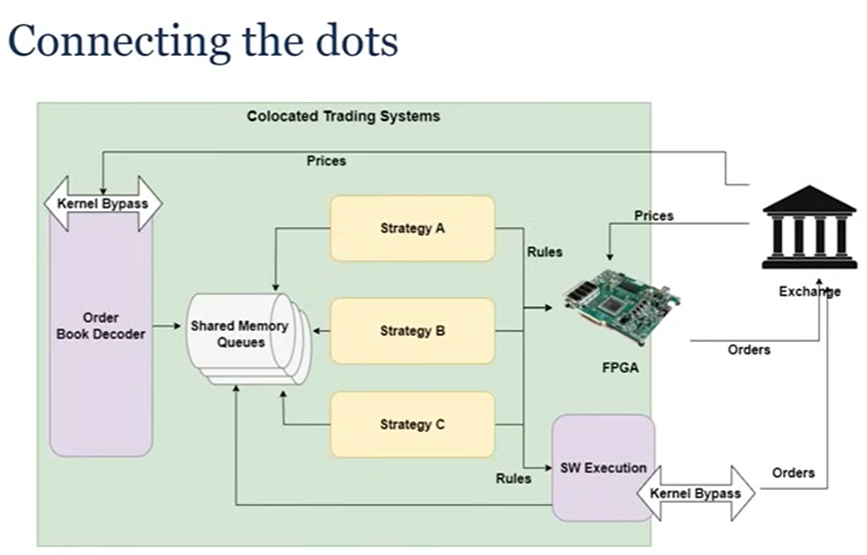
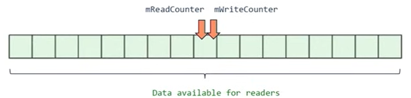
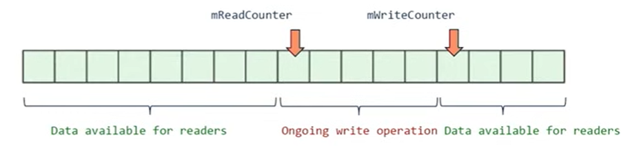
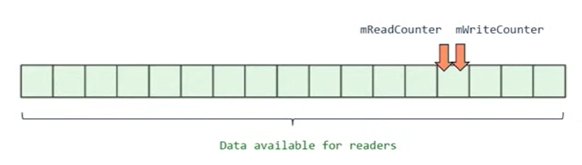

# Principle #6: True efficiency is found not in the layers of complexity we add, but the unnecessary layers we remove



# Shared Memory:

- why shared memory?
  - if you are locally on a server, you don't need sockets, no need to pay for their complexity
  - "As fast as it gets", don't have the kernel involved
  - Kernel isn't involved in any operations
  - Multi processes requires it - which is good for minimizing operational risk

What works well in shared memory

- contiguous blocks of data: arrays
- One writer, one or multiple readers -> stay away from multiple writers!

In practice:
using C API

```c
shm_open, mmap, munmap, shm_unlink, ftruncate, flock...

struct ProtocolHeader
{
    std::array<char, PROTOCOL_NAME_MAX_LENGTH> protocol_name;
    uint64_t magic_number;
    uint64_t buffer_size;
    uint32_t major_version;
    uint32_t minor_version;
    std::array<uint32_t, MAX_NUM_QUEUES> queue_size_bytes;
    uint8_t reserved[...];  // space for future protocol changes
} __attribute__((aligned));
```

# Concurrent queues

One used in this implementation
Bounded? : Yes, simpler and faster
Blocking? : No, readers don't affect the writer
num Consumers? : Many
Message Size? : Variable length
Dispatch? : Fan-out
Type Support? : PODs

# Principle 7: CHoose the right tool for the right task

# FastQueue


2 counters:

- write counter / read counter
- both modified by the producer (producer has no idea if there is a consumer or not)
- consumers only read the counters (they don't modify them)
- these counters have the same value, they point to the same element when there is no write operation
  
- when a write operation happening, the write counter is first advanced
- then you copy your data
- then you advance your read counter
  

```c
struct FastQueue
{
    // Both counters are written by the producer, read by the consumer(s).
    // Before/after a write operation, both counters contain the same value.

    // [WriteCounter, ReadCounter] defines the area where data can be read
    aligns(CACHE_LINE_SIZE) std::atomic<uint64_t> mReadCounter{0};

    // [ReadCounter, WriteCounter] defines the area where data is being written to
    aligns(CACHE_LINE_SIZE) std::atomic<uint64_t> mWriteCounter{0};

    aligns(CACHE_LINE_SIZE) uint8_t mBuffer[0];
};
```

API:

```c
struct QProducer{
  // simplified code
  void Write(std::span<std::byte> buffer) {
    const int32_t payloadSize = sizeof(int32_t) + buffer.size();
    mLocalCounter += payloadSize;

    mQ->mWriteCounter.store(mLocalCounter, std::memory_order_release);

    std::memcpy(mNextElement, &size, sizeof(int32_t));
    std::memcpy(mNextElement + sizeof(int32_t), buffer.data(), buffer.size());

    mQ->mReadCounter.store(mLocalCounter, std::memory_order_release);

    mNextElement += payloadSize;
  }
};

struct QConsumer{
  int32_t TryRead(std::span<std::byte> buffer){ // returns #byte read, 0 if nothing to read
    if (mLocalCounter == mQ->mReadCounter.load(std::memory_order_acquire))
        return 0;

    int32_t size;
    std::memcpy(&size, mNextElement, sizeof(int32_t)); // Data race

    int32_t writeCounter = mQ->mWriteCounter.load(std::memory_order_acquire);
    EXPECT(writeCounter - mLocalCounter <= QUEUE_SIZE, "queue overflow");
    EXPECT(size <= buffer.size(), "buffer space isn’t large enough");

    std::memcpy(buffer.data(), mNextElement + sizeof(size), size); // Data race

    const int32_t payloadSize = sizeof(size) + size;
    mLocalCounter += payloadSize;
    mNextElement += payloadSize;

    writeCounter = mQ->mWriteCounter.load(std::memory_order_acquire);
    EXPECT(writeCounter - mLocalCounter <= QUEUE_SIZE, "queue overflow");
  }
}
```
- use std::memcpy on the size, not just =operator, is to avoid any alignment issue, have to use std::memcpy, really important
- possible data race in TryRead, std::memcpy, we are copying data while there is concurrent access on non-atomic variables 
  - Solution: P1478R5: Byte-wise atomic memcpy

56 min
